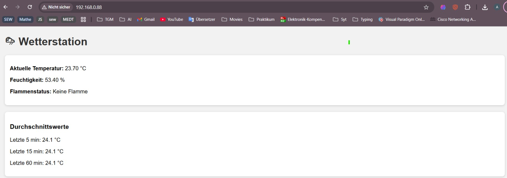
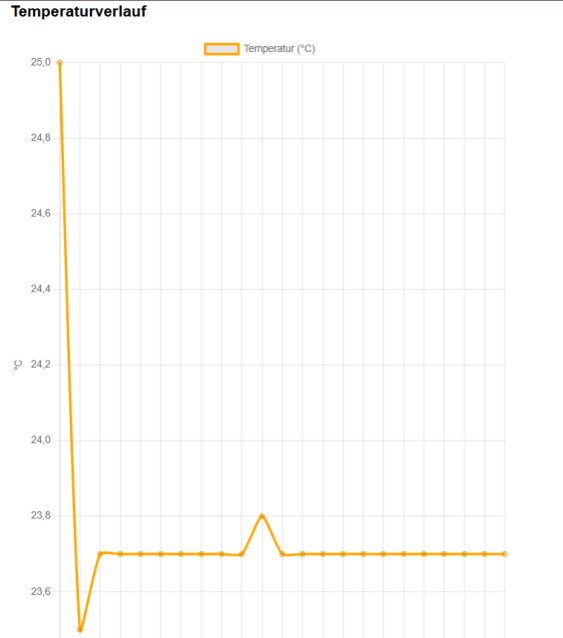
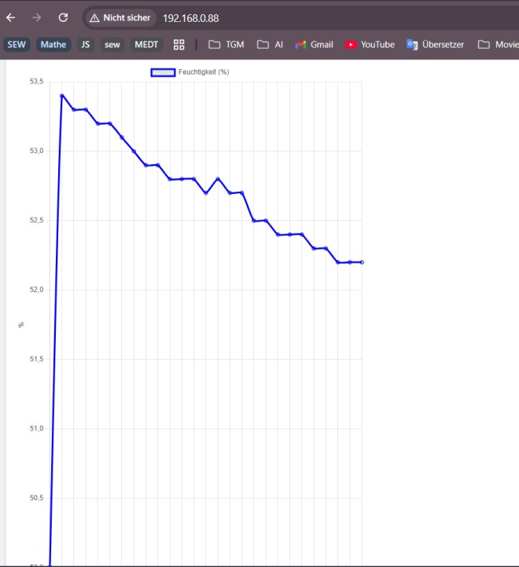
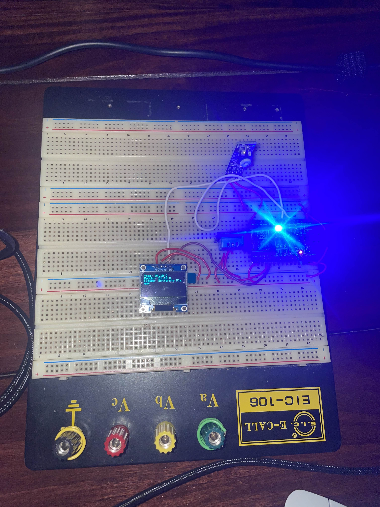
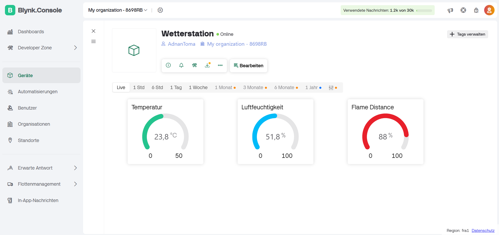
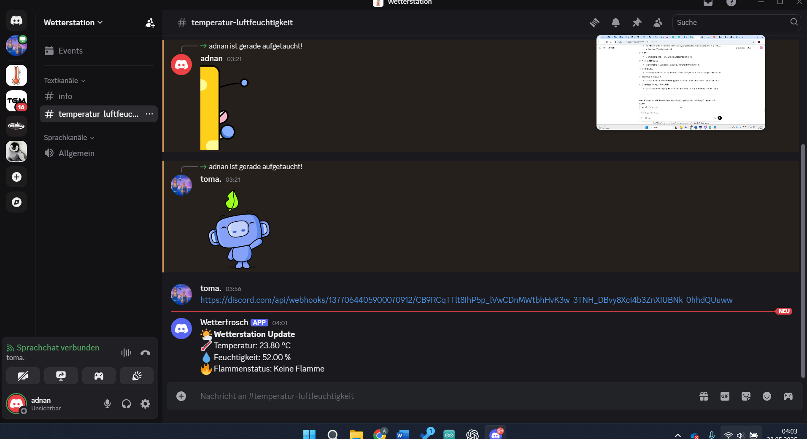

# Wetterstation 2025  
Adnan Wase & Toma Sapoundjiev  
Datum: 27.05.2025

## Projektübersicht  
Unser Projekt „Wetterstation“ verwendet einen ESP32 C3 zur messung von Temperatur, Luftfeuchtigkeit und dem Flammenstatus. Die gemessenen Sensordaten werden auf einem OLED-Display, über einen Webserver, die Blynk-App sowie einen Discord-Webhook dargestellt.

## Verwendete Komponenten

- **ESP32 C3**  
  Mikrocontroller zur Steuerung des gesamten Systems

- **DHT11 Sensor**  
  Zur Messung von Temperatur (in °C) und Luftfeuchtigkeit (in %)

- **Flammensensor B05**  
  Erkennt die Nähe einer Flamme und gibt den Messwert als Prozentwert aus

- **OLED-Display (SSD1306, I2C)**  
  Zeigt Live-Daten direkt am Gerät an

- **Eingebaute RGB-LED (WS2812, GPIO 8)**  
  Dient zur Anzeige des aktuellen Systemstatus

- **Webserver (HTML + Chart.js)**  
  Zeigt aktuelle Daten und einfache Graphen im Browser

- **Blynk Cloud App**  
  Zeigt die Daten mobil per Smartphone oder PC

- **Discord Webhook Integration**  
  Sendet regelmäßig Messwerte auf einen Discord-Server

## Aufbau  
Der Aufbau enthält den ESP32, alle Sensoren und das Display. Die gesammte Schaltung erfolgt auf einem Steckbrett.  

## Features

- Messung von Temperatur und Luftfeuchtigkeit über DHT11  
- Flammenstatus als Prozentwert mit Textbeschreibung  
- OLED-Display zeigt Live-Daten  
- Webserver mit:
  - HTML-Oberfläche und eingebetteten Graphen (Chart.js)
  - Live-Datenübertragung per JSON und AJAX
- Automatische WLAN-Fallback-Funktion über Access Point

## Webserver  
Das Webinterface zeigt Temperatur, Luftfeuchtigkeit und Flammenstatus als Zahlenwerte und in Graphen. Die Darstellung wird alle 10 Sekunden aktualisiert, ohne die Seite neu zu laden.  

### Graph Temperatur  

### Graph Luftfeuchtigkeit  

## Status-LED Logik  

- **Blau**: Normalzustand/Normalbetrieb
- **Orange blinkend**: Temperatur über 25 °C  
- **Rot blinkend**: Keine WLAN-Verbindung  

## Blynk  

- Die Blynk-App zeigt die aktuellen Messwerte für Temperatur, Luftfeuchtigkeit und Flammenstatus an  
- Die Daten werden auf einem mobilen Gerät oder im Browser übersichtlich dargestellt (V0, V1, V2)    

## Discord  

- Ein Discord-Bot sendet alle 4 Minuten eine Nachricht mit den aktuellen Werten  
- Die Nachricht enthält Temperatur, Luftfeuchtigkeit, Flammenwert und Zeitstempel  
- Die Daten werden übersichtlich auf einem festgelegten Serverchannel veröffentlicht  

